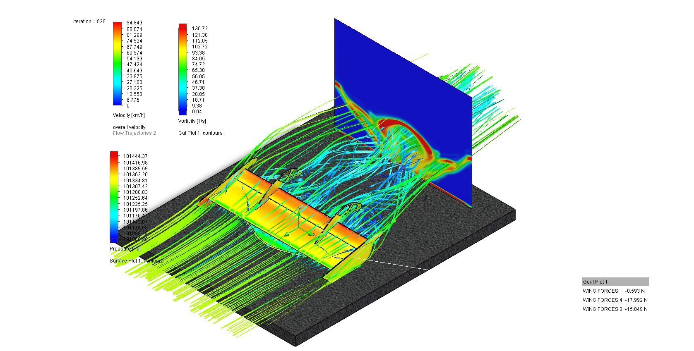
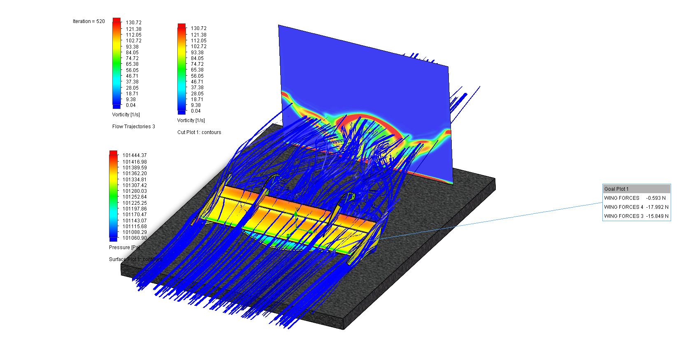

# Racing Kart Aero-Package Development 🏎️💨

**Role:** Lead Design Engineer<!--[cite: 3] -->  
**Timeline:** 2025 - Present<!--[cite: 3] -->

**Overview**  
Spearheading the aerodynamic optimization of a racing kart chassis front wing utilizing S1223 multi-element airfoils and NACA profiles.<!--[cite: 3] --> Originally conceived as an advanced independent study to understand the core mechanics of CFD and master SolidWorks modeling, the project serves as a hands-on exploration of fluid behaviors, aerodynamic efficiency, and cornering grip optimization.

**Computational Fluid Dynamics (CFD)**  
Simulating airflow, downforce, and drag at specific ride heights using CFD.<!--[cite: 3] --> The goal is to extract highly accurate data on boundary layers and pressure distribution across the S1223 front wing profile, iterating designs to minimize drag and control vorticity.

<table align="center">
  <tr>
    <th align="center">🏎️ Version 1 (Baseline Design)</th>
    <th align="center">🏁 Version 2 (Optimized Aero-Package)</th>
  </tr>
  <tr>
    <td align="center">
      <em>Velocity Flow Trajectories</em> 
      
    </td>
    <td align="center">
      <em>Velocity Flow Trajectories</em> 
      
    </td>
  </tr>
  <tr>
    <td align="center">
      <em>Vorticity Analysis</em> 
      
    </td>
    <td align="center">
      <em>Vorticity Analysis</em> 
      
    </td>
  </tr>
</table>

  <em>Pressure Distribution & Close-up Vorticity (V2)</em> 
  
  

**Tools & Software:** CFD, SolidWorks.<!--[cite: 3] -->
